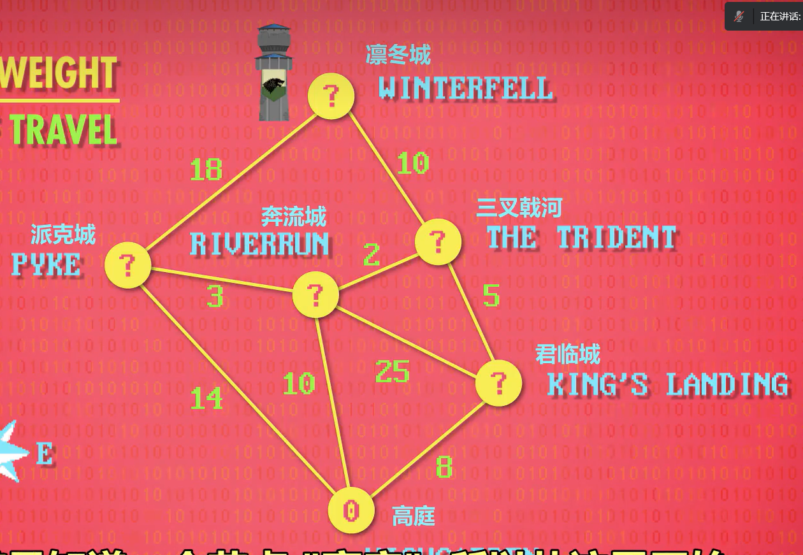
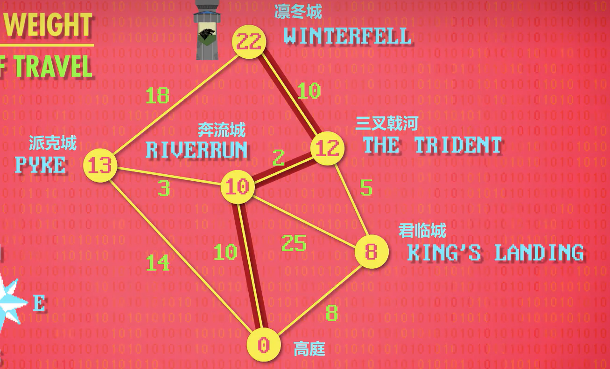

### 最短路径   dijkstra

隔壁翼灵招新最后一题**最短路径**有点似曾相识的感觉，刚好学了一点点dijkstra，稍微写写dijkstra思路

首先先举个例子，如果亚文 geigei要从**高庭**去**凛冬城**找魅力四射的房子姐姐，现在有如下地图

从高庭开始有很多条路，每条路消耗的体力值不同，怎样消耗**最小**的体力到达凛冬城？!(C:\Users\86189\Desktop\lec\-git-\picture\屏幕截图_20221121_145821.png)

最**暴力**的做法就是枚举，每一种方法都走一次，但这样做的时间复杂度是O(n!)

如果利用dijkstra，时间复杂度就只有**O(n^2)**（似乎不同的情况时间复杂度不同），具体操作如下

因为要找最短的路径，所以在每个节点（城市）加上到达该节点（城市）的最小的体力消耗；

到达**派克城**的路径有：1，高庭——》派克城  （体力消耗：14）

​									2，高庭——》奔流城——》派克城 （体力消耗：13）。。。。。

​									故**派克城**取13
以此类推，最终结果可见下图；

这样就能找到去凛冬城最小的体力消耗的路径了捏

-------------------------------------------------------------------------------

回归到题目

每次只能向下或者向右移动一步，所以一个格子只需加上min(上面格子里的值，左边格子里的值)，最终输出最右下角的格子里的值即可；

但需注意一点，第一列只能向下移动，第一行只能向右移动，即只有**一种路径**，所以要先处理一下

~~~c++
for(i=2;i<=n;i++)
        a[i][1]+=a[i-1][1];
    for(i=2;i<=m;i++)
        a[1][i]+=a[1][i-1];
~~~

完整代码附上

~~~c++
#include <iostream>
using namespace std;
int main()
{
    int a[101][101]={0},n,m,i,j,x,y;
    cin >> n >> m;
    for(i=1;i<=n;i++)
    {
        for(j=1;j<=m;j++)
        {
            cin >> a[i][j];
        }

    }
    for(i=2;i<=n;i++)
        a[i][1]+=a[i-1][1];
    for(i=2;i<=m;i++)
        a[1][i]+=a[1][i-1];
    for(i=2;i<=n;i++)
    {
        for(j=2;j<=m;j++)
        {
            if(a[i-1][j]<a[i][j-1])
            {
                a[i][j]+=a[i-1][j];
            }
            else
            {
                a[i][j]+=a[i][j-1];
            }
        }
    }
    cout << a[n][m];
    return 0;
}
~~~

