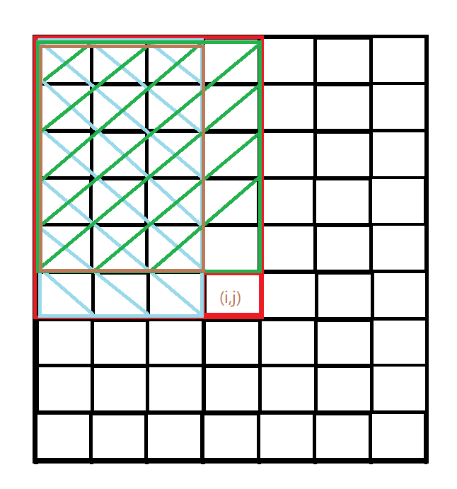
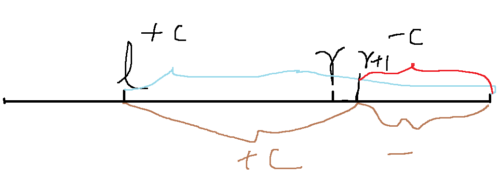
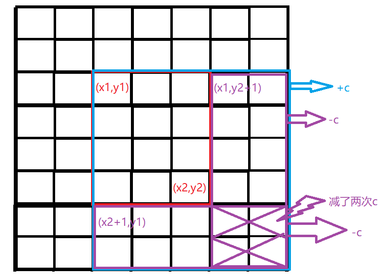

# 前缀和与差分

## 前缀和

- 前缀和的定义  :  对于一个数组，若$s[n]=a[1]+...+a[n](n\ge1)$则称$s[n]$为$a[n]$的==**前缀和**==。


- 例如：若有原一维数组$a[1],a[2],a[3],a[4],a[5]$

  - 则有 一维前缀和数组  区间[1,4]的前缀和为$s[4]-s[0]$（此处关于$s[0]$的描述  稍后会做出说明。）

   -  以此类推，若求数组区间==$[ l , r ]$==的前缀和，应为==$s[r]-s[r-1]$==。

  - 其中，$s[n]=s[n-1]+a[n] $。

  **^解释推演^**

  ​		$s[r] = a[1]+a[2]+a[3]+\cdots+a[l-1]+a[l]+\cdots+a[r]$

  ​		$s[l-1]=a[1]+a[2]+a[3]+\cdots+a[l-1]$

  ​		^两式相减则得^ ==$s[r]-s[l-1] = a[l]+\ldots+a[r]$==,即为所求前缀。

  

  > 由于推理公式为$s[r]-s[l-1]$,而为了保证此式的连贯性和正确性（也就是存在$s[1]-s[0]$而不出现$s[-1] ~~or~~ a[-1]$的情况）此，我们使得数组$a$的下标从$1$开始，而数组$s$的下标从$0$开始，同时请注意$s[0]$的值为了不影响后续计算，应满足
  >
  > $s[0]=0$。  

### 一维前缀和的应用

##### acwing.795.前缀和

输入一个长度为 $n$ 的整数序列。

接下来再输入 $m$ 个询问，每个询问输入一对 $~~l~~,~~r~~$。

对于每个询问，输出原序列中从第  $l$ 个数到第 $r$ 个数的和。

###### 输入格式

第一行包含两个整数 $n$ 和 $m$。

第二行包含 $n$ 个整数，表示整数数列。

接下来 $m$ 行，每行包含两个整数 $l$ 和 $r$，表示一个询问的区间范围。

###### 输出格式

共 m 行，每行输出一个询问的结果。

###### 数据范围

$1≤l≤r≤n1≤l≤r≤n$,

$1≤n,m≤1000001≤n,m≤100000$,
        $−1000≤数列中元素的值≤1000$

###### 输入样例：

```
5 3
2 1 3 6 4
1 2
1 3
2 4
```

###### 输出样例：

```
3
6
10
```

###### 题解

```c
#include<stdio.h>
#define N 100010
int num[N];
int s[N];

int main()
{
    int n,m;
    scanf("%d %d",&n,&m);
    for(int i = 1 ;i<=n;i++) scanf("%d",&num[i]);
    for(int i = 1 ;i<=n;i++) s[i] = s[i-1] + num[i];
    while(m--)
    {
        int l,r;
        scanf("%d %d",&l,&r);

        printf("%d\n",s[r]-s[l-1]);
    }

    return 0;

}
```


### 二维前缀和

#### 图解

 

.png)

- 若求蓝色区域$\rm [x_1,y_1]~[x_2,y_2]$的前缀和，则先算出$\rm s[x_2][y_2]$再减去两个黄色框的前缀和，分别为$\rm s[x_1-1][y_2]$ , $\rm s[x_2][y_1-1]$。此时，会发现打`×`区域被多减了一次，因此要再加上一次打`×`区域的前缀和$\rm s[X_1-1][y_1-1]$。

	

	#### 区间前缀和公式

	- 推出区间前缀和公式：$\rm (x_1,y_1)-(x_2,y_2)$的前缀和公式为==$s[x_2][y_2]-s[x_1-1][y_2]-s[x_2][y_1-1]+s[x_1-1][y_1-1]$==

	### 二维前缀和公式

	

	##### 图解

	- 
	- 若求$s[i][j]$，则先求得蓝色框前缀和$s[i-1][j]$加上绿色框前缀和$s[i][j-1]$,此时，类似于上图解，棕色区域的前缀和$s[i-1][j-1]$被加和两次，因此需要减去,再加上$a[i][j]$即可得到前缀和$s[i][j]$。

	#### 二维前缀和公式

	- ==$s[i][j]=s[i-1][j]+s[i][j-1]-s[i-1][j-1]+a[i][j]$==

### 二维前缀和的应用

##### acwing.796.子矩阵的和

输入一个 n 行 m 列的整数矩阵，再输入 q 个询问，每个询问包含四个整数 x1,y1,x2,y2，表示一个子矩阵的左上角坐标和右下角坐标。

对于每个询问输出子矩阵中所有数的和。

###### 输入格式

第一行包含三个整数 n，m，q。

接下来 n 行，每行包含 m 个整数，表示整数矩阵。

接下来 q 行，每行包含四个整数 x1,y1,x2,y2，表示一组询问。

###### 输出格式

共 q 行，每行输出一个询问的结果。

###### 数据范围

$1≤n,m≤10001≤n,m≤1000$,
$1≤q≤2000001≤q≤200000$,
$1≤x1≤x2≤n1≤x1≤x2≤n$,
$1≤y1≤y2≤m1≤y1≤y2≤m$,
$−1000≤矩阵内元素的值≤1000$,

###### 输入样例：

```
3 4 3
1 7 2 4
3 6 2 8
2 1 2 3
1 1 2 2
2 1 3 4
1 3 3 4
```

###### 输出样例：

```
17
27
21
```


###### 题解

```c
#include<stdio.h>
#define N 1010

int num[N][N],s[N][N];

int main()
{
    int n,m,q;
    scanf("%d %d %d",&n,&m,&q);
    
    for(int i = 1;i<=n;i++)
        for(int j = 1;j<=m;j++)
            scanf("%d",&num[i][j]);
            
    for(int i = 1 ; i<=n;i++)
        for(int j = 1 ; j<=m;j++)
            s[i][j] = s[i-1][j] + s[i][j-1] - s[i-1][j-1] + num[i][j];
            
    
    while(q--)
    {
        int x,y,x1,y1;
        scanf("%d %d %d %d",&x,&y,&x1,&y1);
        printf("%d\n",s[x1][y1] - s[x-1][y1]-s[x1][y-1] + s[x-1][y-1]);
    }
    
    return 0;
}
```

## 差分

### 一维差分数组

- 若存在数组$a[1],a[2],a[3],\cdots,a[n]$,数组$b[1],b[2],b[3],\cdots,b[n]$,且满足，

	- $b[1]=a[1]$

	- $b[2]=a[2]-a[1]$

	- $b[3]=a[3]-a[2]$

		$\vdots$            $\vdots$           $ \vdots$

	- $b[n]=a[n]-a[n-1]$

则称$b[n]$为$a[n]$的差分数组，且$a[n]$是$b[n]$的前缀和数组。

~~（yxc：怎样构造差分不重要，不需要了解）~~

#### 应用

##### acwing.797.差分

输入一个长度为 n 的整数序列。

 接下来输入 m 个操作，每个操作包含三个整数 l,r,c，表示将序列中 $[l,r]$ 之间的每个数加上 c。

请你输出进行完所有操作后的序列。

##### 输入格式

第一行包含两个整数 n 和 m。

第二行包含 n 个整数，表示整数序列。

接下来 m 行，每行包含三个整数 l，r，c，表示一个操作。

##### 输出格式

共一行，包含 n 个整数，表示最终序列。

##### 数据范围

$1≤n,m≤100000$,

$m≤100000$,
$1≤l≤r≤n$,
$−1000≤c≤1000,
$−1000≤整数序列中元素的值≤1000$

##### 输入样例：

```
6 3
1 2 2 1 2 1
1 3 1
3 5 1
1 6 1
```

##### 输出样例：

```
3 4 5 3 4 2
```

#### 题解

欲求得操作后的数组，可构造差分数组。

想得到区间$[~l~,~r~]$中进行了$+c$操作后的数组，可对差分数组中的$b[l]+c$且$b[r+1]-c$求前缀和即可得到操作后的数组$a[n]$。




```c++
#include<iostream>

using namespace std;

const int N = 100010;

int n,m;
int a[N],b[N];

void insert(int l,int r,int c)
{
	b[l] += c;
	b[r+1] -= c;
}

int main()
{
	scanf("%d%d",&n,&m);
	for(int i = 1;i<=n;i++) scanf("%d",&a[i]);

	for(int i = 1;i<=n;i++) insert(i,i,a[i]);//把b[]变成a[]的差分
	
    while(m--)
    {
    	int l,r,c;
    	scanf("%d %d %d",&l,&r,&c);
    	insert(l,r,c);
	}
	
	for(int i = 1;i<=n;i++) b[i] += b[i-1];
	
	for(int i = 1;i<=n;i++) printf("%d ",b[i]);
	
	return 0;
}
```

- 第21行代码向$b[n]$中插入$a[n]$的行为实质上是才重复定义中的$b[n]=a[n]-a[n-1]$此操作。


### 二维差分数组


#### acwing.798.差分矩阵

#### 应用

输入一个 n 行 m 列的整数矩阵，再输入 q 个操作，每个操作包含五个整数 x1,y1,x2,y2,c，其中 (x1,y1)和 (x2,y2) 表示一个子矩阵的左上角坐标和右下角坐标。

每个操作都要将选中的子矩阵中的每个元素的值加上 c。

请你将进行完所有操作后的矩阵输出。

##### 输入格式

第一行包含整数 n,m,q。

接下来 n 行，每行包含 m 个整数，表示整数矩阵。

接下来 q 行，每行包含 55 个整数 x1,y1,x2,y2,c，表示一个操作。

##### 输出格式

共 n行，每行 m 个整数，表示所有操作进行完毕后的最终矩阵。

##### 数据范围

$1≤n,m≤1000$,
$1≤q≤100000$,
$1≤x1≤x2≤n1≤x$,
$1≤y1≤y2≤m$,
$−1000≤c≤1000$,
$−1000≤矩阵内元素的值≤1000$

##### 输入样例：

```
3 4 3
1 2 2 1
3 2 2 1
1 1 1 1
1 1 2 2 1
1 3 2 3 2
3 1 3 4 1
```

##### 输出样例：

```
2 3 4 1
4 3 4 1
2 2 2 2
```


##### 题解




-  图为构造了差分之后的差分数组，欲求得原数组$(x1,y1)至(x2,y2)$区间进行$+C$操作后的数组，则，先给差分数组$(x1,y1)$进行$+C$操作，此时会发现两紫框是进行了额外的操作。那么，对紫框进行$-C$操作，而两紫框交界处进行了一次$+C$操作，两次$-C$操作，所以对紫框交界处再进行$+C$操作。

- 对于差分数组的构造只需要拓展一维的插入即可。

```c
#include<stdio.h>
const int N = 1010;
int a[N][N],b[N][N];
void insert(int x1,int y1,int x2,int y2,int c)
{
    b[x1][y1] += c;
    b[x2+1][y2+1] += c;
    b[x1][y2+1] -= c;
    b[x2+1][y1] -= c;
}
int main()
{
    int n , m , q ;
    scanf("%d %d %d",&n,&m,&q);
    
    for(int i = 1;i<=n;i++)
        for(int j = 1;j<=m;j++)
            scanf("%d",&a[i][j]);
            
    for(int i = 1;i<=n;i++)
        for(int j = 1;j<=m;j++)
            insert(i,j,i,j,a[i][j]);
            
    while(q--)
    {
        int x1,x2,y1,y2,c;
        scanf("%d %d %d %d %d",&x1,&y1,&x2,&y2,&c);
        insert(x1,y1,x2,y2,c);
    }
    
    for(int i = 1;i<=n;i++)
        for(int j = 1;j<=m;j++)
            b[i][j] +=b[i-1][j] + b[i][j-1] - b[i-1][j-1];
            
    for(int i = 1;i<=n;i++)
    {
        for(int j = 1;j<=m;j++)
        {
            printf("%d ",b[i][j]);
        }
        printf("\n");
    }
    return 0;
}
```

