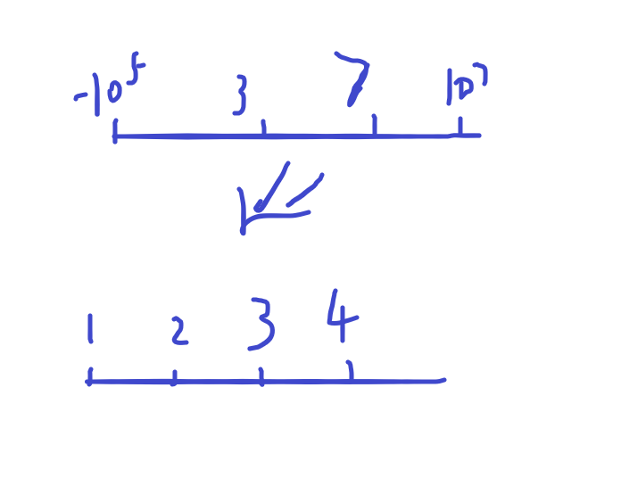

# 

**离散化**


首先使用离散化是什么条件捏？

想一想？

比如平常的数的范围在   0~100000 那么可以用数组下标表示位置

But ！

如果是   -10e9 ~ 10e9捏？？？

这时候就可以用到离散化啦（一般情况下，当然哈希表也可以处理）

如果说有很大一份数，它散落在一个大的区间上（这个区间你不能用数组下标表示时），就需要用到离散化啦！！！

离散化 比如



通过这种方式把离散开的数映射到另一个数轴上（这里的是排好序了）

现在就拿acwing的  802.区间和来举例把

最重要的一步  离散化到新的位置

### 离散化

```c++
//二分查找应该都会把！！！！
int find(int x)
{
  int l=0,r=alls.size()-1;    /*这里的alls是所有的坐标出现的总和区间当然进行了  排序和去重 x就是离散化之前的坐标  至于为何要r+1 因为数组下标从0开始
    						然后要数轴从1开始*/
  while(l<r)
  {
    int mid=(l+r)>>1;
    if(alls[mid]>=x)r=mid;
    else l=mid+1;
  }
  return r+1;
}
// 这个二分查找模版是找到第一个>=x的数的坐标,x存在的时候就返回x的坐标（第一次出现那个）
```

**这里我认为是大家比较迷惑的点（问的挺多的点）**

```c++
 for(int i=0;i<n;i++)
  {
    int x,c;
    cin>>x>>c;
    add.push_back({x,c});
    alls.push_back(x);    //将要赋值的坐标压入alls
  }
  for(int i=0;i<m;i++)
  {
    int l,r;
    cin>>l>>r;
    query.push_back({l,r});
    alls.push_back(l);
    alls.push_back(r);  //这里压入是为了后面查找的查找找到相应的位置
  }
  sort(alls.begin(),alls.end());
  alls.erase(unique(alls.begin(),alls.end()),alls.end());  这里是排序和去重   是为了去掉x ,l , r出现相同的情况
  //这里压入坐标是为了方便查询坐标，以便映射出所有的坐标；
```


```c++
//这里是为了方便找到各个区间的和    用法和前面的前缀和是一样的捏！
for(int i=1;i<=alls.size();i++)s[i]=s[i-1]+a[i];
```

### 最后整段代码附上！

```c++
#include<iostream>
#include<vector>
#include<algorithm>
using namespace std;
//pair是类似于结构体的二元结构
vector<pair<int,int>>add,query;//add 是要压入的坐标和那个值,query是查询的那个值
vector<int>alls;
const int N=3e5+10;//原题是1e5  这里要压入3次坐标所以开到这么大防止越界
int a[N],s[N];
int find(int x)
{
  int l=0,r=alls.size()-1;
  while(l<r)
  {
    int mid=(l+r)>>1;
    if(alls[mid]>=x)r=mid;
    else l=mid+1;
  }
  return r+1;
}
int main()
{
  int n,m;
  cin>>n>>m;
  for(int i=0;i<n;i++)
  {
    int x,c;
    cin>>x>>c;
    add.push_back({x,c});
    alls.push_back(x);
  }
  for(int i=0;i<m;i++)
  {
    int l,r;
    cin>>l>>r;
    query.push_back({l,r});
    alls.push_back(l);
    alls.push_back(r);
  }
  sort(alls.begin(),alls.end());
  alls.erase(unique(alls.begin(),alls.end()),alls.end());
  for(auto item : add){
    int x=find(item.first);
    a[x]+=item.second;
  }
  for(int i=1;i<=alls.size();i++)s[i]=s[i-1]+a[i];
  for(auto item:query)
  {
    int l=find(item.first);
    int r=find(item.second);
    cout<<s[r]-s[l-1]<<'\n';
  }
  return 0;
}
```

